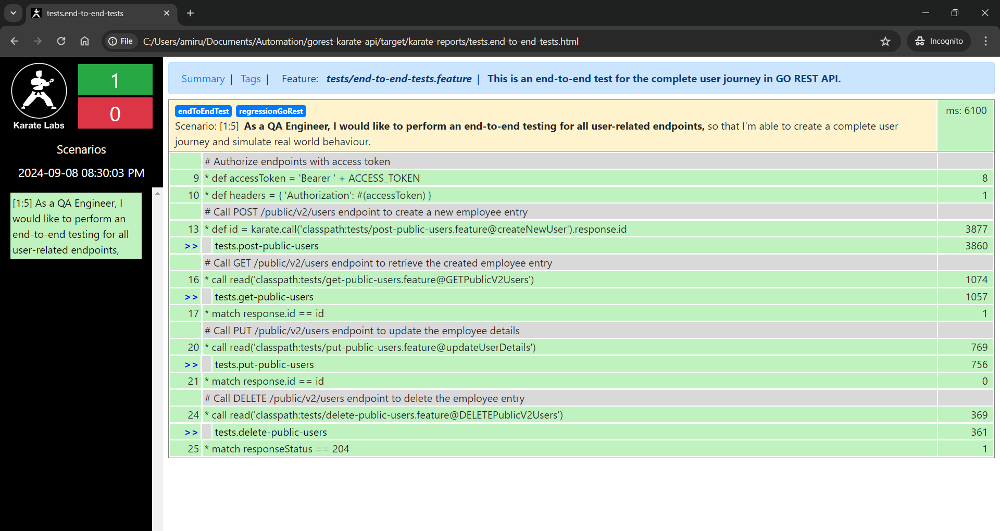

# GO REST API Project

## Overview
GO REST API project is an API automation test project designed based on the endpoints available at https://gorest.co.in.
This project is set up using Karate, an open-source test automation framework which is widely used for API test automation (see more at https://github.com/karatelabs/karate).
Maven is also used as a build automation tool to help with test execution.

Test scenarios are written based on Gherkin Cucumber syntax `Given, When, Then` (see more at https://cucumber.io/docs/gherkin/).
This approach makes it effortless in defining the test requirements, actions and validations to be implemented in the scenario which makes it suitable even for non-programmers to begin with.
It is also carefully designed to allow seamless and frictionless contribution, be it seasoned engineers with years of experience in test automation or greenhorns who were just about to kickstart their test automation journey.

## Getting Started
This project is created with the following setup which serves as a guideline to the required pre-requisites:
1. Java version 17 or above.
2. Apache Maven version 3.8.1 or above.
3. `JAVA_HOME`, `MAVEN_HOME` and `ACCESS_TOKEN` environment variables.
   1. `ACCESS_TOKEN` should be generated via https://gorest.co.in/my-account/access-tokens and stored in the system.
4. IntelliJ IDEA with below plugins which may not be readily bundled:
   1. Cucumber for Java
   2. Gherkin
   3. Karate
5. Clone the project with the command `git clone https://github.com/amirulzahiddin/gorest-karate-api.git`.
6. Build and run the project with the command `mvn clean install`.

## Project Structure
This project is designed based on the `/users` endpoints comprising the common HTTP methods used in software development, namely `GET`, `POST`, `PUT`, `DELETE` amongst others.
1. `properties` folder contains the request and response body in `.json` format, along with enums and error messages.
2. `tests` folder contains all the scenarios written based on the Gherkin syntax `Given, When, Then` in standard Cucumber `.feature` format.
The files comprise positive and negative scenarios written in a dynamic approach to achieve robust test automation.
3. `utils` folder contains the common functions written in Java and act as helpers for code reusability.
```
src/test
    |
    \-- java
        |
        \-- properties
        |   |
        |   +-- error-messages.json
        |   +-- get-request-body.json
        |   +-- post-request-body.json
        |   +-- put-request-body.json
        |   +-- response-body.json
        |   +-- user-enums.json
        |
        \-- tests
        |   |
        |   +-- delete-public-users.feature
        |   +-- end-to-end-tests.feature
        |   +-- get-public-users.feature
        |   +-- post-public-users.feature
        |   +-- put-public-users.feature
        |
        \-- utils
        |   |
        |   +-- commonUtils.java
        |
        +-- config.json
        +-- karate-config.js
        +-- logback-test.xml
        +-- TestRunner.java
```
While this project is specifically tailored for `/users` endpoint, the structure can also be enhanced to accommodate other endpoints including `/posts`, `/comments` and `/todos` to achieve large scale project maintainability.
This can be easily done by breaking `tests` and `properties` folder into sub-folders named after the endpoints to cater for different scenarios, request and response body respectively.

## Executing Tests
1. To execute all tests, run the command `mvn clean test`.
2. To execute specific test(s), navigate to any of the feature files to identify the Karate tags needed for test execution.
   1. Run the command `mvn clean test "-Dkarate.options=--tags @specify-karate-tag-here"`.
   2. If the `ACCESS_TOKEN` environment variable is not set as prescribed under Getting Started section, the generated access token can be directly included in the command `mvn clean test "-Daccess.token=specify-access-token-here" "-Dkarate.options=--tags @specify-karate-tag-here"`.
3. Once the test is successfully executed, a summary of the test execution will be printed along with the HTML report as illustrated below:
```
---------------------------------------------------------
feature: classpath:tests/end-to-end-tests.feature
scenarios:  1 | passed:  1 | failed:  0 | time: 6.0999
---------------------------------------------------------

20:30:04.249 [main] INFO  com.intuit.karate.Suite - <<pass>> feature 2 of 5 (0 remaining) classpath:tests/end-to-end-tests.feature
20:30:04.261 [main] DEBUG com.intuit.karate.Suite - waiting for 5 features to complete
Karate version: 1.4.1
======================================================
elapsed:   9.15 | threads:    1 | thread time: 6.10
features:     1 | skipped:    4 | efficiency: 0.67
scenarios:    1 | passed:     1 | failed: 0
======================================================

HTML report: (paste into browser to view) | Karate version: 1.4.1
file:///C:/Users/user/Documents/Automation/gorest-karate-api/target/karate-reports/karate-summary.html
===================================================================

Tests run: 1, Failures: 0, Errors: 0, Skipped: 0, Time elapsed: 9.693 sec

Results :

Tests run: 1, Failures: 0, Errors: 0, Skipped: 0

[INFO] ------------------------------------------------------------------------
[INFO] BUILD SUCCESS
[INFO] ------------------------------------------------------------------------
[INFO] Total time:  13.153 s
[INFO] Finished at: 2024-09-08T20:30:04+08:00
[INFO] ------------------------------------------------------------------------
```
4. Click on the HTML report link to view the report in the browser.
   

## Notes
1. This full documentation is published at https://github.com/amirulzahiddin/gorest-karate-api.
